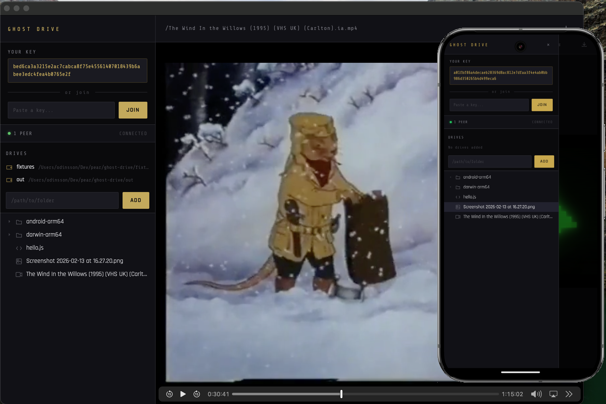

# Ghost Drive

Experimental peer-to-peer file sharing and media preview app built on the [Holepunch](https://holepunch.to) stack.

Share local folders across devices over encrypted P2P connections — no servers, no cloud.



## Tech Stack

- **[bare](https://github.com/holepunchto/bare)** / **[bare-native](https://github.com/holepunchto/bare-native)** — Runtime and native app builds (macOS, Android)
- **[hyperswarm](https://github.com/holepunchto/hyperswarm)** — Peer discovery and connections via DHT
- **[corestore](https://github.com/holepunchto/corestore)** — Persistent identity and storage
- **[distributed-drive](https://www.npmjs.com/package/distributed-drive)** — Aggregates multiple drives (local, remote) with RPC over protomux
- **[localdrive](https://github.com/holepunchto/localdrive)** — File system drive interface
- **[cellery](https://github.com/holepunchto/cellery)** / **[cellery-html](https://github.com/holepunchto/cellery-html)** — Reactive UI cells over WebSocket

## Features

- Add local drive folders to share
- Automatic sharing of drive meta to Peers over stream. Files are not copied, they are streamed.
- Browse files with lazy-loaded directory tree
- Preview video, audio, images, and text files
- Stream media over P2P connections in chunks
- Join peers by key — persistent across restarts
- Persistent identity via corestore keypair
- Cross-platform: macOS desktop + Android
- Any drive added is shared with Peers. One peer might add 10 different drives, and 2nd peer just connects to them, and caches files for later use! You don't need to know where the original file comes from, no duplicates, just transparent file access.

### Supported Drives

- LocalDrive - Add a path
- HyperDrive - Add a key
- gip-remote - Add a `git+pear://...` url

## Usage

```bash
# Install dependencies
npm install

# Build and run (macOS)
npm run dev

# Build for Android
npm run build:android
```

On startup, your peer key is displayed in the sidebar. Share it with another device running Ghost Drive and enter it in the "Join" field to connect.

Add local folders via the "Drives" section — files are only shared after explicitly adding a drive path.

## Status

This is an early experiment. Known limitations:

- No encryption/whitelisting of peers yet (anyone with your key can browse)
- File type detection is extension-based
- No file upload/write support
